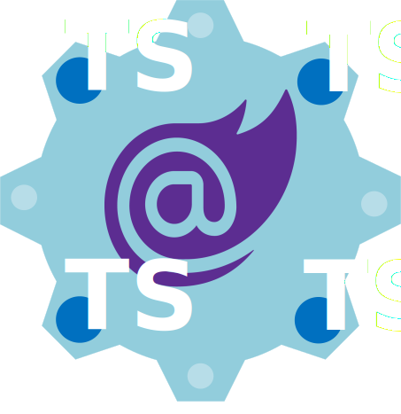

# Blazor Typescript Interop
{ width=35%}
This is an article on Blazor Typescript Interop. 
An elegant way to interface your Blazor C# with the browsers Javascript API.
Discussion will contain a brief overview on the technology 
with a focus on why, when and how to use it.
In addition, an implementation walkthrough will further explain the concepts by code example on GitHub.    

{ width=10% }
&nbsp;&nbsp;&nbsp;&nbsp;**Blazor** is a formative addition to the .NET stack for building .NET Core SPA MVVM websites in 
web-assembly (Wasm) coded in C#. Blazor is an attractive alternative to Angular, React, Vue and other Javascript SPA website architectures for the .NET developer.
Blazor MAUI, a continuation of Xamarin with Blazor webview is another great addition to the .NET stack that comlpletes a .NET developer ecosystem for device and browser applications.

{ width=10% }
&nbsp;&nbsp;&nbsp;&nbsp;**Typescript** is a superset of JavaScript for application-scale development featuring strong types and structured for object oriented programming.
Typescript transpiles to Javascript, so references to Javascipt going forward is either plain old Javascript or the result of transpiled Typescript consumable by the browser.

 { width=10% }
&nbsp;&nbsp;&nbsp;&nbsp;**Interop** is an interface between a higher level coding language to a lower level language, typically the native language of the platform.
Data elements and procedures can be interchanged between the two languages. Blazor out of the box uses interop to communicate with the browser.
The browser executes Wasm code oneway. Wasm needs Javascript interop to communicate back to the browser. Hence Blazor C# needs Javascipt interop.
Existing .NET libraries such as C# Blazor WebSocket class are Javascript interop wrappers.

